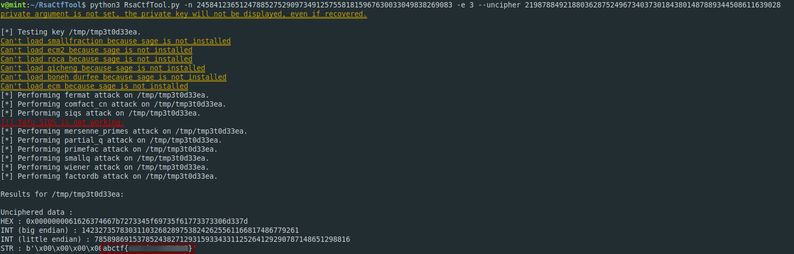

**RSA Beginner**
-------------
[Challenge Link](https://mega.nz/#!zD4wDYiC!iLB3pMJElgWZy6Bv97FF8SJz1KEk9lWsgBSw62mtxQg)  

> I found this scribbled on a piece of paper. Can you make sense of it?

After some googling I found this [amazing tool](https://github.com/3summer/CTF-RSA-tool).  
One-liner command to get the flag

