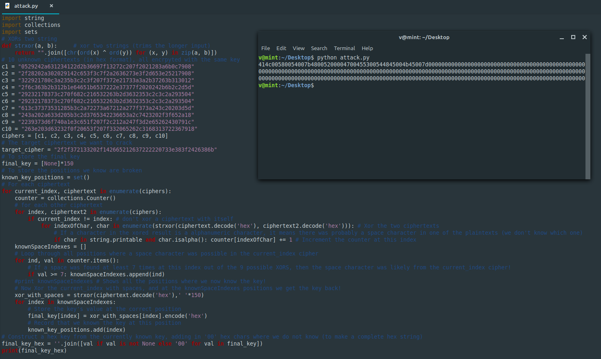

**Many time secrets**
-------------
[Challenge Link](https://mega.nz/#!DGxBjaDR!tMWkHf0s0svmkboGd-IASHsS9jACxSYx4zi_ETsyzyQ)  

> Fady learnt from his old mistake and decided to use one-time pad as his encryption technique.

I learnt how to attack this encryption method from [here](https://crypto.stackexchange.com/questions/2249/how-does-one-attack-a-two-time-pad-i-e-one-time-pad-with-key-reuse).  
I needed to practically learn more about crib-dragging.. After some googling I found this [amazing explanation](http://travisdazell.blogspot.com/2012/11/many-time-pad-attack-crib-drag.html).  
Guess what.. After some googling I found a python script which did the attack for me:D  
Download the source code from [here](https://github.com/Jwomers/many-time-pad-attack/blob/master/attack.py).. All rights reserved to them.

I replaced c[1-10] and the target cipher and made a small modification to directly get the hex value of the flag.  
Decode it and you will get some unreadable characters which you can easily guess.
