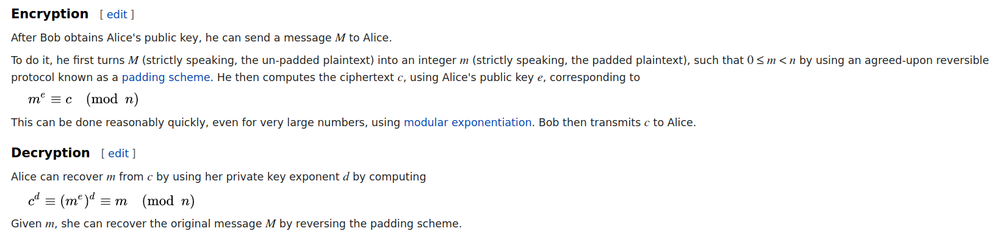

**RSA Noob**
-------------
[Challenge Link](https://mega.nz/#!al8iDSYB!s5olEDK5zZmYdx1LZU8s4CmYqnynvU_aOUvdQojJPJQ)  

> Can you help me decode these numbers?

I read for a bit about [RSA](https://en.wikipedia.org/wiki/RSA_(cryptosystem)).

In this challenge `e = 1` so breaking the cipher would be easy.  
To break it we need `m` but we don't have it.. I thought of calculating `c mod n` since we have both of them.. I used this [site](https://miniwebtool.com/modulo-calculator/?number1=9327565722767258308650643213344542404592011161659991421&number2=245841236512478852752909734912575581815967630033049838269083).  
After calculating.. It turned out that `c = m`.  
There's no method to directly convert a decimal number to a string so I decided to convert `c` to hex then string and it worked!  
For converting you can use [CyberChef](https://gchq.github.io/CyberChef/) or whatever you like.
