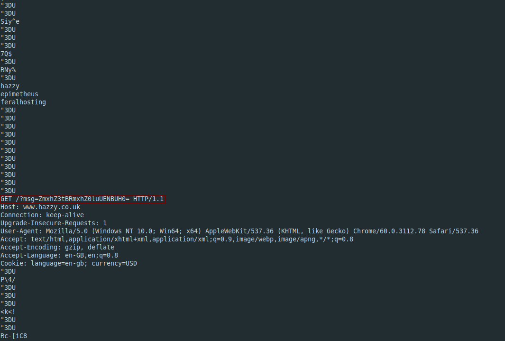

**A CAPture of a Flag**
-------------
[Challenge Link](https://mega.nz/#!3WhAWKwR!1T9cw2srN2CeOQWeuCm0ZVXgwk-E2v-TrPsZ4HUQ_f4)  

> This isn't what I had in mind when I asked someone to capture a flag.. Can you help?

I decided to check `strings` before doing any kinda analysis.. I noticed this.

It's a base64-encoded string.. Decode it to get the flag.  
This was the second base64-encoded string I noticed in `strings` so it didn't take me much to find.  
You can also open the file with [Wireshark](https://www.wireshark.org/) then capture the TCP stream and you will find the same encoded string.
