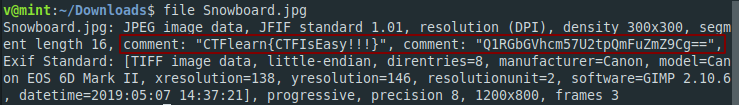

**Snowboard**
-------------
[Challenge Link](https://ctflearn.com/challenge/934)  

> Find the flag in the jpeg file.

Let's check the file type.

The first comment isn't the flag.. The second comment is a base64 string.. Decode it to get the flag.
