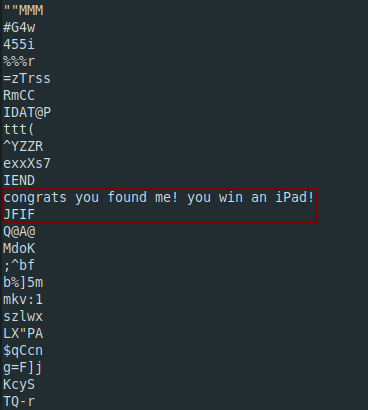
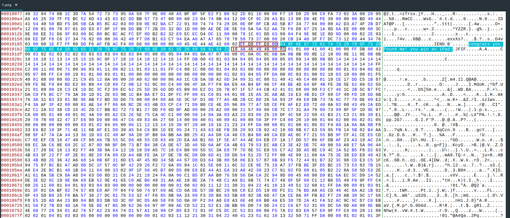
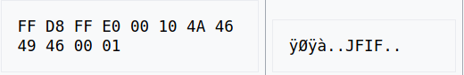

**Bobby Toe's iPad**
-------------
[Challenge Link](https://mega.nz/#!iWAm2KJL!2uRVDKrHOWryZkZNW6leV0sQMh-b0-AYQksa3i-A3Eg)  

> Here is a pic of my friend Bobby Toe.  
> While he's happy to give you his iPad, he's not as willing to give you the flag.. Can you get it from him?

I checked the `file` type and it was correct.  
I didn't find any compressed files using `binwalk`  
While I was checking `strings` I noticed this

Interesting! Let's open it with a hexeditor.. I used [Bless](https://github.com/bwrsandman/Bless).  

I searched this [list of signatures](https://en.wikipedia.org/wiki/List_of_file_signatures) for JFIF signature.

We have to delete `congrats you found me! you win an iPad!` in order to have a correct header for the JFIF.  
Extract the hexdump with the correct header to a new file then save the changes to both of them.  
Now you have two pictures.. Original and Extracted.  
After some googling I thought I would seperate the original picture frame by frame based on color layers.  
I used the command `zsteg-mask`  
Now I have 20+ pictures.. One of them had weird string.. I tried to submit it but it wasn't the flag.  
The extracted picture had a string too.. I thought this is a [Vigenere Cipher](https://www.dcode.fr/vigenere-cipher).  
I was correct.. Decode it using the string in the extracted picture and you will get the flag.

***I like this challenge.***
