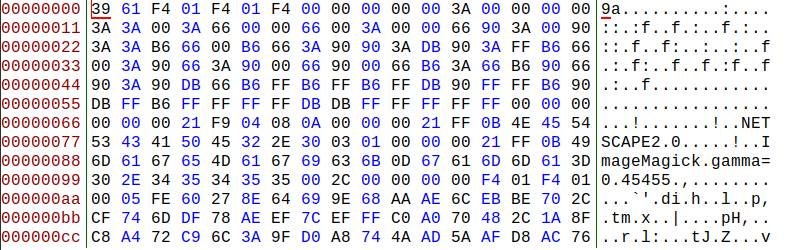
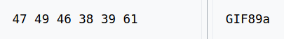

**Corrupted File**
-------------
[Challenge Link](https://mega.nz/#!aKwGFARR!rS60DdUh8-jHMac572TSsdsANClqEsl9PD2sGl-SyDk)  

> Help! I can't open this file.

I opened this corrupted file with [Bless](https://github.com/bwrsandman/Bless) to check the file header.

I searched this [list of signatures](https://en.wikipedia.org/wiki/List_of_file_signatures) for `9a`

I edited the header then saved the changes.  
It was a fast GIF so I slowed it down using this [site](https://ezgif.com/).  
We got a base64 string.. Decode it to get the flag.
