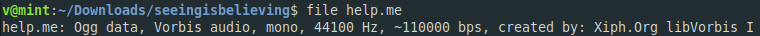

**Seeing is believing**
-------------
[Challenge Link](https://mega.nz/#!LTRUTaZb!9Nh0NwDONJQiOThif3G62evP8H_W9eIJSu0PdBQWKyg)  

> My colleague's an astronaut who's currently on a mission orbiting in space.  
> Just a few hours ago, unfortunately, his communication device caught fire so he's unable to report back to base.  
> I did, however, receive a strange file that I can't seem to open.  
> I think it may shed some light on his situation.  
> Can you help me save poor boy Johnny?

Let's check the `file` type.

I didn't know anything about Ogg data or Vorbis audio.. I read about them [here](https://www.lifewire.com/what-is-an-ogg-file-2622795).  
We need to convert this file to `.mp3` in order to hear the message.. I used this [site](https://convertio.co/mp3-converter/).  
I heard some weird noise.. I thought of analyzing the frequencies.. I used this [site](https://academo.org/demos/spectrum-analyzer/).  
The site gave me a clue to what to do next but it wasn't clear enough.  
After some googling I found an advanced program called [Sonic Visualiser](https://sonicvisualiser.org/) with which I got a better analysis.  
I played with the tools for a bit to learn what they do.. You gotta learn yourself :D  
Hint: You will solve this with a tool from Pane column in the toolbar.  
I got a QR code and I scanned it using this [site](https://online-barcode-reader.inliteresearch.com/).  
You will get a link.. Open it and you will get the flag.  
