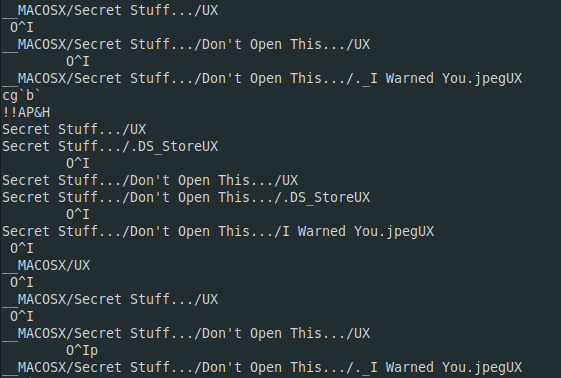
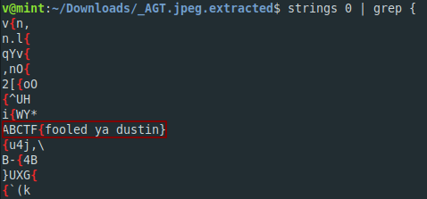

**07601**
-------------
[Challenge Link](https://mega.nz/#!CXYXBQAK!6eLJSXvAfGnemqWpNbLQtOHBvtkCzA7-zycVjhHPYQQ)  

> I think I lost my flag in there.. Hopefully, it won't get attacked.

Check the file type then change it to the correct one.  
Going through `strings` I noticed this  

I extracted the compressed files using the command `binwalk -e`  
I opened the secret file then I got the flag using `strings`

That was pretty easy yeah? you got it the easy way but I was fooled lol.  
I extracted the file at first using the command `binwalk -D='.*'`  
Then I got the same challenge picture but with different name and the secret file didn't appear.  
I checked it with `binwalk` and found another compressed files then I extracted them and got the same.. Infinite loop.  
I tried strings against it and i got the flag.. but it wasn't correct.

  

I got some corrupted pictures but when I tried hex-editing them they were ok!  
I tried `strings` and it got me the flag lol.  
Moral of the story: Don't overanalyze at first.. Go easy.
