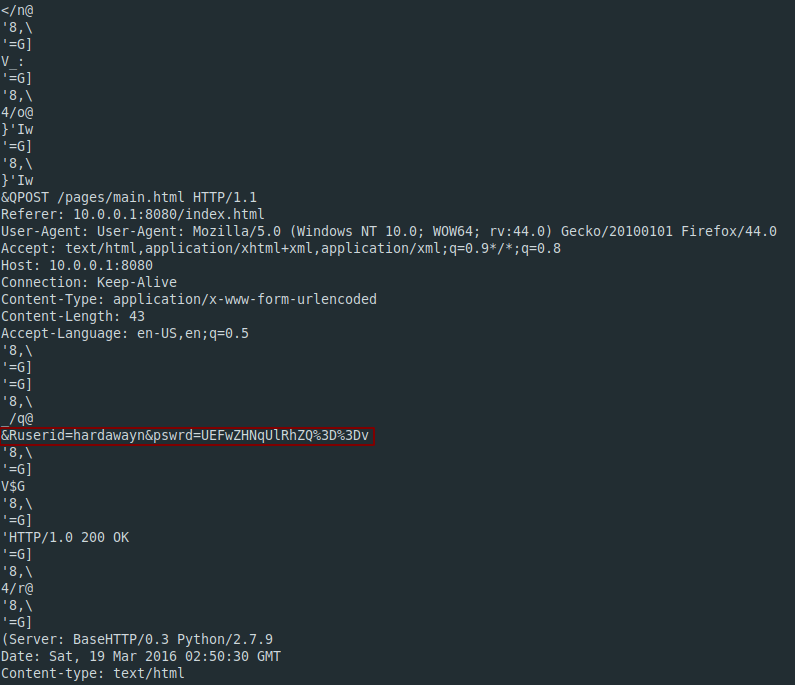

**Digital Camouflage**
-------------
[Challenge Link](https://mega.nz/#!XDBDRAQD!4jRcJvAhMkaVaZCOT3z3zkyHre2KHfmkbCN5lYpiEoY)  

> We need to gain access to some routers.  
> Let's try to check if we can find the password in this captured network data.

Going through `strings` I noticed this.

Base64 encoded string.. I decoded it using this [site](https://www.base64decode.org/).
