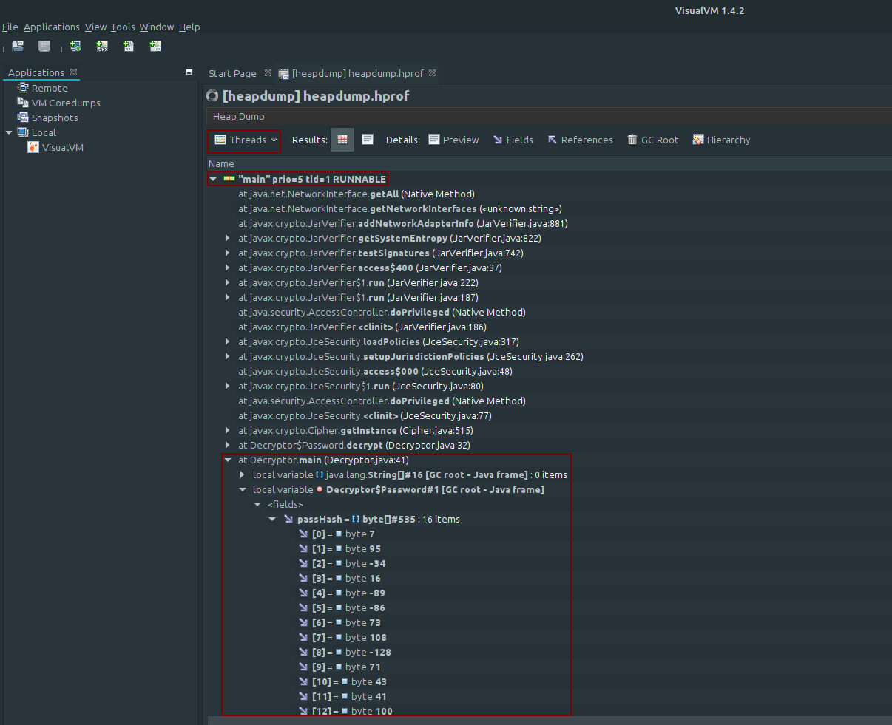
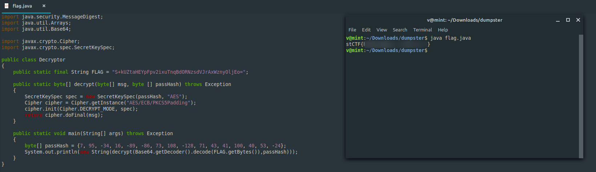

**Dumpster**
-------------
[Challenge Link](https://mega.nz/#!rHYGlAQT!48DlH2pSZg10Ei3f-Ivm7RoNBbV16Qw0wN4cWxANUwY)  

> Our systems detected that someone successfully decrypted this flag.. We took a heap dump of the program (in Java).  
> Can you recover the flag for me?

We got the decryptor source code and a weird `.hprof` file.. I didn't know what to do with it!  
After some googling I learned that I had to download a program called VisualVM to analyze this weird file.  
You can download using the command `sudo apt install visualvm` on Ubuntu-based distributions.  
Again after a lot of googling on how to analyze it.. You have to load the file into the program then..

There're some other bytes I couldn't get in the screenshot.. You have to do it yourself.  
Again and again ugh.. After some googling I learned how to use these bytes to decrypt the flag.. Here's the code.

This was a hard one.. It took me a really long time.
