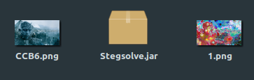

**Exclusive Santa**
-------------
[Challenge Link](https://ctflearn.com/challenge/851)

> Hey! There are so many toys that I want, but I just don't have the money.  
> I don't care which toy I get as long as it's one or the other, but not both!

We got a `.rar` file.. I extracted it and got two pictures.  
Both of them were quite large so I checked them using `binwalk`  
Inside `3.png` I found another picture so I extracted it using `binwalk -D='.*'`  
I noticed that `CCB6` is an enhanced picture from the original `1.png` we got after the first extraction.  
I tried analyzing both of them but got nothing.  
After some googling I thought of merging them and it got me the flag!  

Open Stegsolve > Open CCB6 > Analyse > Image Combiner > Choose 1.png  
You will get the flag but reversed.
