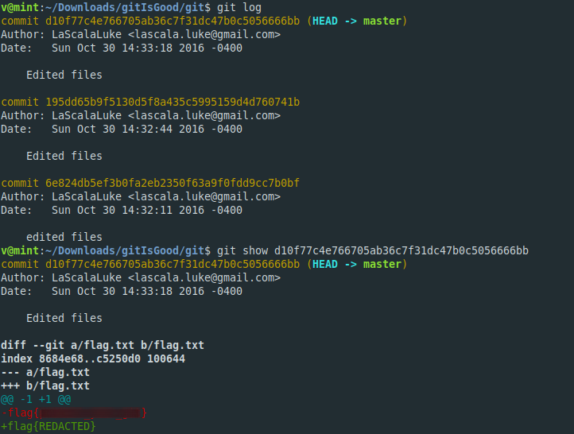

**Git Is Good**
-------------
[Challenge Link](https://mega.nz/#!3CwDFZpJ!Jjr55hfJQJ5-jspnyrnVtqBkMHGJrd6Nn_QqM7iXEuc)  

> The flag used to be there but I redacted it.. Good Luck. 

Extract the zip and you will find `flag.txt`.. of course it's not the correct flag lol.  
After some googling I learnt how to use git.  
let's check the logs. 

