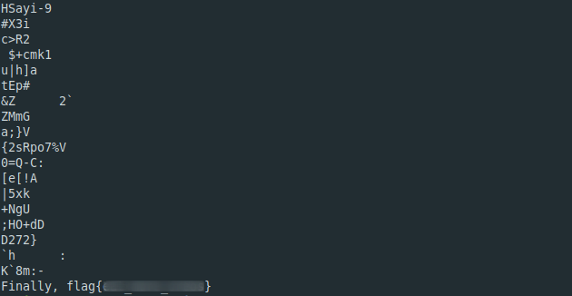

**Milk's Best Friend**
-------------
[Challenge Link](https://mega.nz/#!DC5F2KgR!P8UotyST_6n2iW5BS1yYnum8KnU0-2Amw2nq3UoMq0Y)  

> There's nothing I love more than oreos, lions, and winning.

I checked the file type and it was correct.  
I didn't get anything interesting from `strings`  
I checked it with `binwalk` and it had other compressed file.. I extracted them using the command `binwalk -e`  
I got another picture.. I did the basic analysis and got the flag from `strings`

