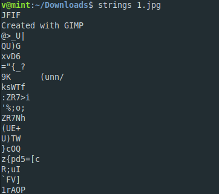

**The adventures of Boris Ivanov.. Part 1**
-------------
[Challenge Link](https://mega.nz/#!OHohCbTa!wbg60PARf4u6E6juuvK9-aDRe_bgEL937VO01EImM7c)  

> The KGB agent Boris Ivanov got information about an attempt to sell classified data.  
> He quickly reacted and intercepted the correspondence.  
> Help Boris understand what exactly they were trying to sell.

I checked the `file` type and it was correct.  
I didn't find any compressed files when I tried `binwalk`  
I checked `strings` to check if I can get any readable text.. I noticed this.

I tried adding/removing filters with GIMP but I couldn't find anything.  
After some googling I found a tool called [Stegsolve](https://www.wechall.net/forum/show/thread/527/Stegsolve_1.3/page-1).  
I played with the tools for a bit to learn what they do.  
Go to `Analyse > Stereogram Solver` and keep clicking on the right-arrow button.  
You will get the flag at offset 102.
