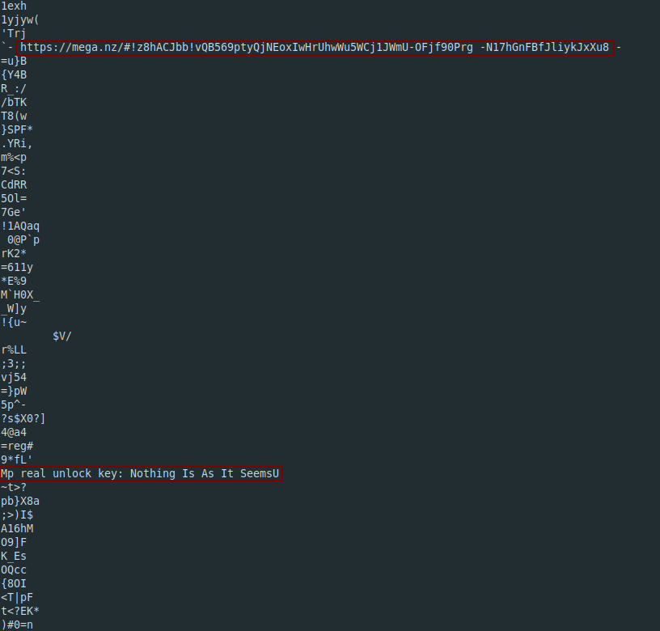

**Up For A Little Challenge?**
-------------
[Challenge Link](https://mega.nz/#!LoABFK5K!0sEKbsU3sBUG8zWxpBfD1bQx_JY_MuYEWQvLrFIqWZ0)  

> You know what to do

Let's run `strings` to check if we can get any readable texts.

Interesting! Let's save this key.. We might need it later.  
Note: There're a password and a flag in the strings.. they both are wrong.   
I opened the link and got another zip file.  
I extracted it and got another picture inside `Did I Forget Again?` folder.. I got lost during analyzing it and I found nothing.  
I opened the zip file again and found another hidden password-protected zip file.  
I extracted it.. the password is the key we saved.  
I got another picture.. I did the basic analysis but found nothing.  
I opened the picture and noticed a strange color in the lower right corner.. It was the flag.
