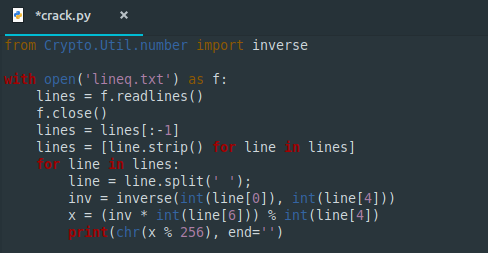

**Lineq**
===================  
[Challenge Link](https://s3-eu-west-1.amazonaws.com/hubchallenges/crypto/lineq.txt)  

> Can you solve some equations for us?  

I had no idea how to get the modular inverse so I googled.  
I found this [list of scripts](https://rosettacode.org/wiki/Modular_inverse) and I was like WHOA!!!   
I also found this [alternative solution](https://www.youtube.com/watch?v=EXfOF7VCr2k).  
I also found a similar simplified script to crack it after a little modification.  

  
Use python3 to run it.
