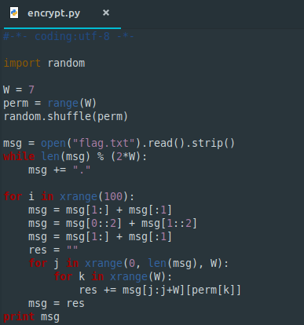
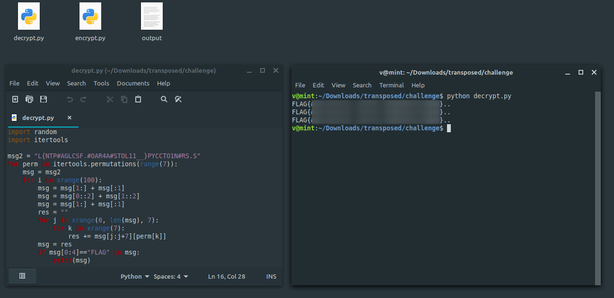

**Transposed**
===================  
[Challenge Link](https://s3-eu-west-1.amazonaws.com/hubchallenges/crypto/transposed.zip)  

> sseemga si dsenarotps?

Interesting yet confusing right? let's give it a try.

  

**We need to understand what's going on so we can break it.**  
1- The code selects a random permutaion from {1,2,3,4,5,6,7}.  
2- It adds some character in the end till the length of the string can be divided by 14.  
3- It swaps the first and the last character of the string.  
4- It slices the string with a step of 2 so basically it seperates the the indices into odd and even.  
5- Swapping again.  
6- It seperates the string to blocks of 7 characters.

I thought of inversing this process but it took a lot of time.  
Since we have a fixed number of strings to test (7!) let's just iterate over them and grep the flag.  

  
