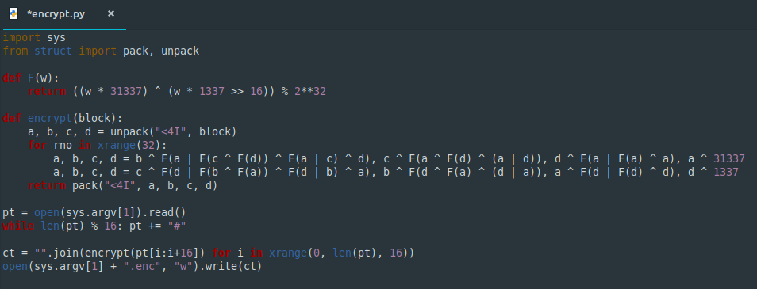
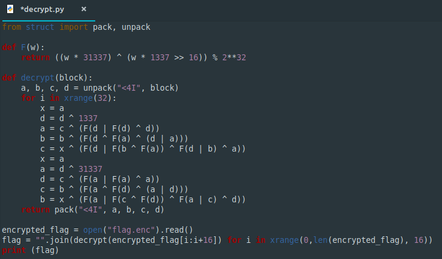

**genfei**
===================  
[Challenge Link](https://s3-eu-west-1.amazonaws.com/hubchallenges/crypto/genfei.zip)  

> We found an encrypted secret and an encrypting machine. It seems to be a complicated cipher, Can you break it?  

I once read about **Feistel Block Cipher** and it's the first thing that came to my mind because of **fei** in the challenge name.  
**Feistel Cipher can be its own inverse** because it depends on XOR.. a XOR b XOR b is a again.  
Let's see what we got.

Let's inverse the `encrypt` function to get the flag.. We should start from the second step to the first one.  
Here is a simple code to do it.

  
Run the code to get the flag.

Learn more about [Feistel Network](https://web.cs.ucdavis.edu/~rogaway/papers/feistel.pdf)
