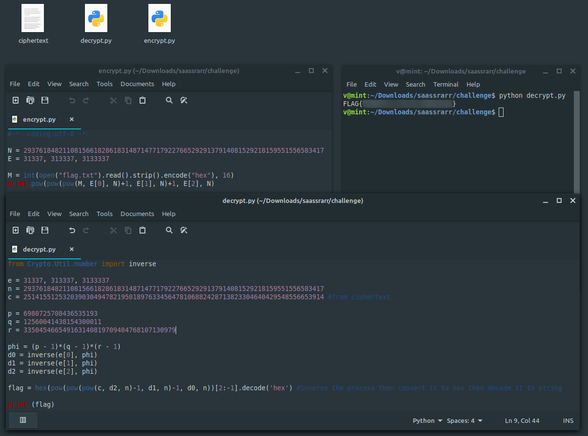

**saassrarr**
===================  
[Challenge Link](https://s3-eu-west-1.amazonaws.com/hubchallenges/crypto/saassrarr.zip)  

> Triple power encryption!

I watched this [video](https://www.youtube.com/watch?v=O-4_oS3G7MI) to learn more about RSA Encryption/Decryption.  
We need to factorize `n` to get `p` and `q`.. I used this [site](http://factordb.com/).  
Three factors? No problem! I learnt from this [answer](https://crypto.stackexchange.com/questions/74891/decrypting-multi-prime-rsa-with-e-n-and-factors-of-n-given) that there's no much difference.  
Now we need to inverse the entire process.. Time for python!

  
