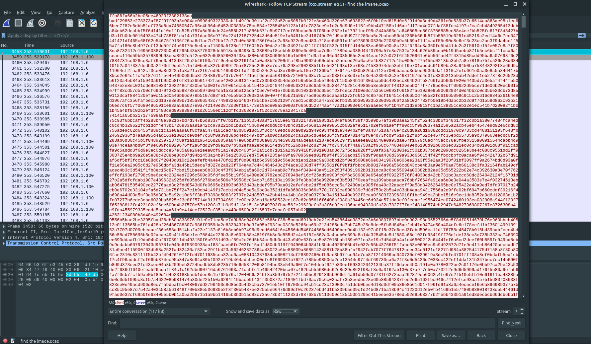
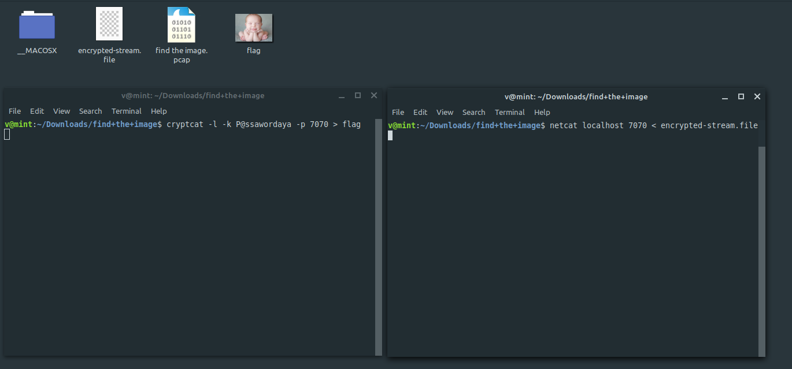

**Cypher Anxiety**
===================  
[Challenge Link](https://s3-eu-west-1.amazonaws.com/talentchallenges/Forensics/find+the+image.zip)  

> An image was leaked from a babies store. The Manager is so annoyed because he needs to identify the image to fire charges against the responsible employee.  
> The key is the MD5 of the image.

After extracting we got a pcap file.. cool.  
Let's check if we can get any readable strings.  
`strings find-the-image.pcap`

  
Interesting.. Let's open wireshark and filter the packets sent on port 7070.  
Follow the stream then save the encrypted output as raw data.  
  
Now we have to simulate the data transfer to get flag.  
Open two terminals.. one to sent data and one to recieve it.  
  
We got a pic.. the flag is the MD5 hash for it.

