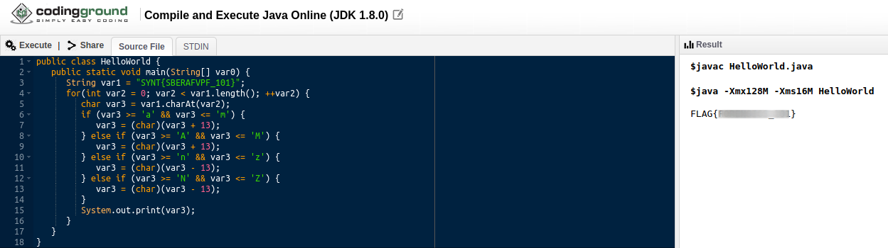

**File Found**
===================  
[Challenge Link](https://s3-eu-west-1.amazonaws.com/hubchallenges/Forensics/foundfile)  

> We found the following file on a machine, we know it contains a secret but we do not know what this file is.    
> Can you help us obtain the code?

Let's determine the file type first.  
  
I had to rename it to **foundfile.class** to get it decompiled on this [Online Decompiler](http://www.decompiler.com/).  
We got the code.. I used this [Online Compiler](https://www.tutorialspoint.com/compile_java_online.php).  
Note: Remove all empty lines.  

