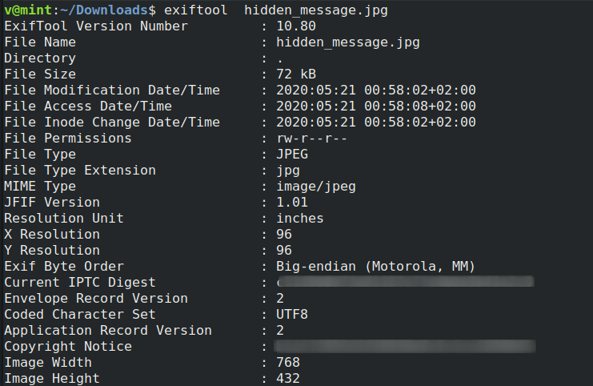

**Hidden Message**
===================  
[Challenge Link](https://s3-eu-west-1.amazonaws.com/talentchallenges/Forensics/hidden_message.jpg)  

> A Cyber Criminal is hiding information in this file. Can you capture the flag?  
> Submit the flag in MD5.

Let's extract the file metadata.  
 `exiftool hidden_message.jpg`

  

I found two different hashes. Let's try them!  
The Copyright hash is the right one.
