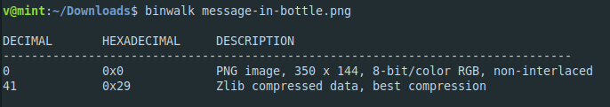
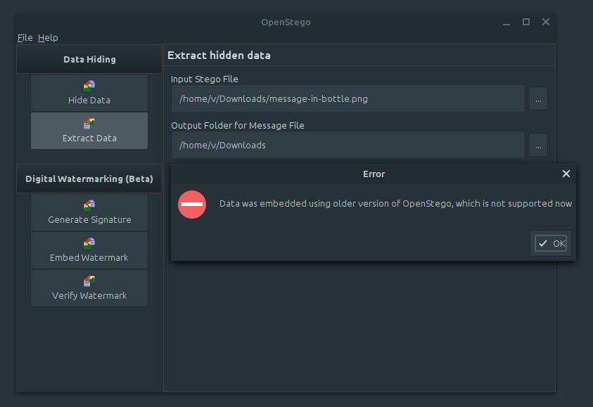

**Message in a Bottle**
===================  
[Challenge Link](https://s3-eu-west-1.amazonaws.com/hubchallenges/Forensics/message-in-bottle.png)  

> That's so easy. Just Capture the Flag.  

I wasn't able to find any readable text after trying `strings` command.  
Let's check if there's any compressed file.

Sadly after extracting it I could not find anything.  
I tried some online **stenganography** tools like [Forensically](https://29a.ch/photo-forensics/#forensic-magnifier), [Steganography Online](https://stylesuxx.github.io/steganography) and [Mobilefish](https://www.mobilefish.com/services/steganography/steganography.php) but sadly again.. I found nothing.  
After some googling I found a tool called [OpenStego](https://www.openstego.com) and I tried it but guess what..  
  
ugh.. let's try an older release.. version 0.6.1 worked with me.. go get the flag.
