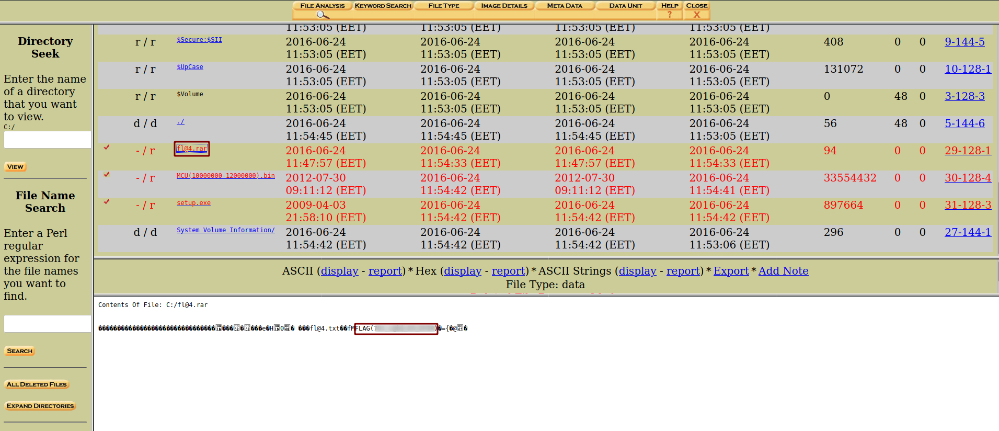

**Partition Lost**
===================  
[Challenge Link](https://s3-eu-west-1.amazonaws.com/talentchallenges/Forensics/partition-lost.img)  

> Our Company's CEO had a car accident. His HDD was damaged and he lost all his files and partitions.    
> Can you help him to recover his important data?

Let's open **Autopsy** to analyze this image.  
Follow along with all the boring steps to create a new case file and add the image.  
Note: Make sure to choose the image type as **Partition** not **Disk**.  
Do some basic analysis..  
  
