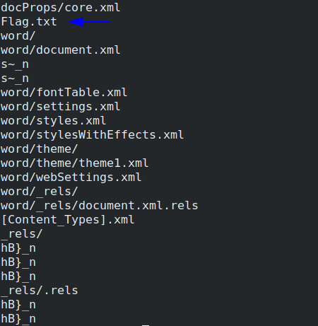

**G&P List**
===================  
[Challenge Link](https://s3-eu-west-1.amazonaws.com/talentchallenges/Forensics/G%26P+lists.docx)  

> Just Open the File and Capture the flag.  
> Submission in MD5

Let's try `strings` to see if we can get any readable text.

  

I went through the strings and I found this.  
Let's extract the file.  
Note: Rename the file before running the command because it has &)    
`binwalk -e G-P+lists.docx`  
Open the extracted folder.. We got the flag!
