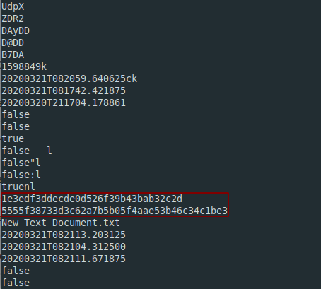

**Antonia**
===================  
[Challenge Link](https://hubchallenges.s3-eu-west-1.amazonaws.com/Forensics/ANT.ad1)  

> Antonia evidence from the IR team.. Can you please double-check the photo hash for integrity?  
> Format: flag{md5:sha1}

Going through `strings` I noticed six different hashes.. I decided to try them.. The first two were correct.
