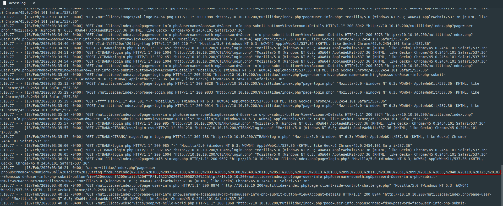

**CTBank**
===================  
[Challenge Link](https://hubchallenges.s3-eu-west-1.amazonaws.com/Forensics/access.7z)  

> Our client bank is under attack.. May the logs will help.

I opened the file.. Going through.. I noticed this

  

URL-encoded format.. I decoded it using [this site](https://www.urldecoder.org/).  
I got some ASCII.. I converted them using [this site](https://onlinestringtools.com/convert-ascii-to-string).
