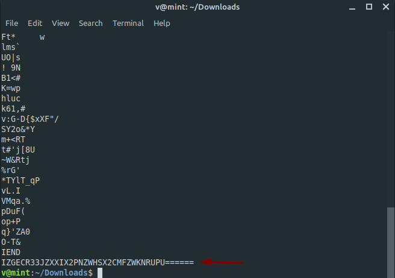

**I love images**
===================  
[Challenge Link](https://s3-eu-west-1.amazonaws.com/hubchallenges/Forensics/godot.png)  

> A hacker left us something that allows us to track him in this image, can you find it?  

Let's try `strings` to see if we can get any readable text.

  
Encoded string.. Decode it however you like.. It's the flag.
