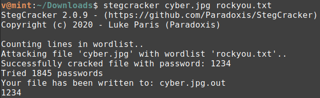

**Images3c**
===================  
[Challenge Link](https://hubchallenges.s3-eu-west-1.amazonaws.com/Forensics/cyber.zip)  

> Securing an important image requires good encryption so we added extra security layer for your photo and now is unbreakable!

I didn't find anything using the basic analysis so I tried [StegCracker](https://github.com/Paradoxis/StegCracker) and got the flag!

