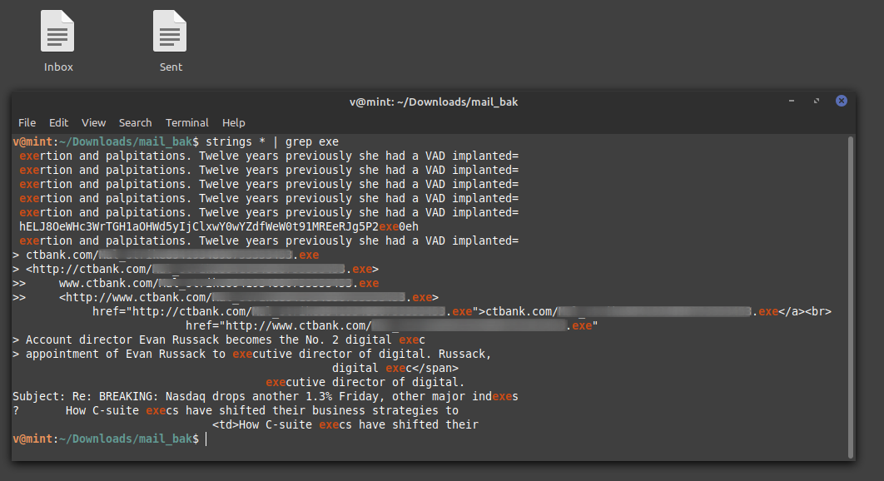

**Mailer**
===================  
[Challenge Link](https://hubchallenges.s3-eu-west-1.amazonaws.com/Forensics/mail_bak.7z)  

> We got the evidence for the phishing email but we need to know the name of malware file. 

I thought of searching the `strings` output for any executable files since we're looking for a malware name.

  

Put the name in the flag format and that's it!
