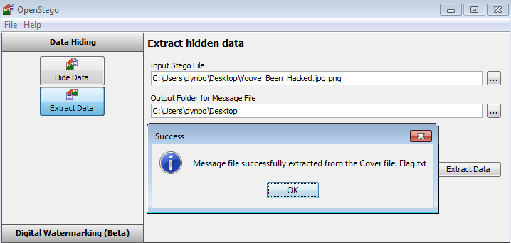

**You have been hacked**
===================  
[Challenge Link](https://s3-eu-west-1.amazonaws.com/hubchallenges/Forensics/Youve_Been_Hacked.jpg.png)  

> We can hide secret messages, try to capture the flag.  
> Submit answer in MD5.

The basic analysis didn't get me anything so I tried multiple steganography tools.. [OpenStego](https://www.openstego.com/) got it for me.

