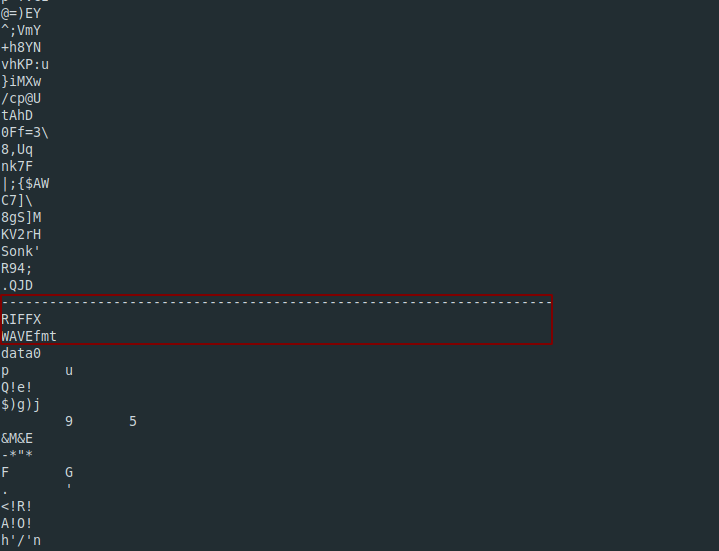
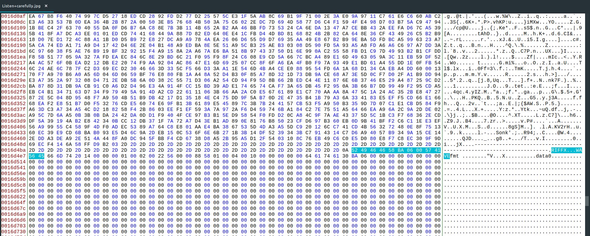

**Listen Carefully**
===================  
[Challenge Link](https://s3-eu-west-1.amazonaws.com/hubchallenges/Forensics/Listen+carefully.jpg)  

> A wanted hacker knew he was going to get arrested, he wanted to save a secret before he was arrested.  
> The police tech team found that this image was the last accessed file.  
> Please help the police find the evidence.

The `file` type was correct.  
The header was correct.  
I checked with `binwalk` and nothing showed up.  
When I was going through `strings` I noticed this

  

There was somehow an audio file.. I had no idea how to extract it.  
I thought of opening the file with a hexeditor.. I used [Bless](https://github.com/bwrsandman/Bless).  
I searched for RIFF to get there fast.  

  

I checked the signatures using this [list](https://en.wikipedia.org/wiki/List_of_file_signatures) and they both were correct.  
I decided to create a new file with the hexdump from there to the end.. It worked out.  
I saved the changes and got a new audio file.  
I opened it and heard some weird noise.. I thought of analyzing the frequencies.. I used this [site](https://academo.org/demos/spectrum-analyzer/).  
Submit what you will get with no further decoding.. It's the flag :D  
Note: If you can't see well you can use [Sonic Visualiser](https://sonicvisualiser.org/) for a better analysis.
