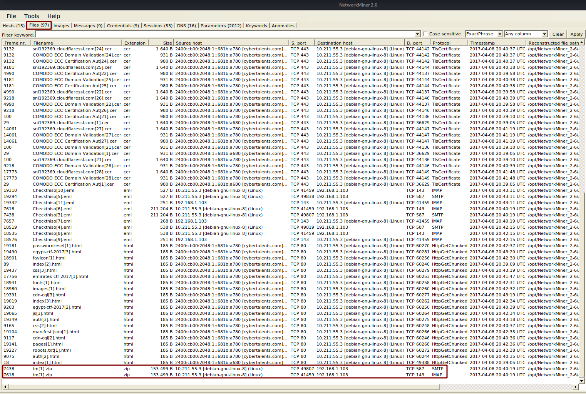
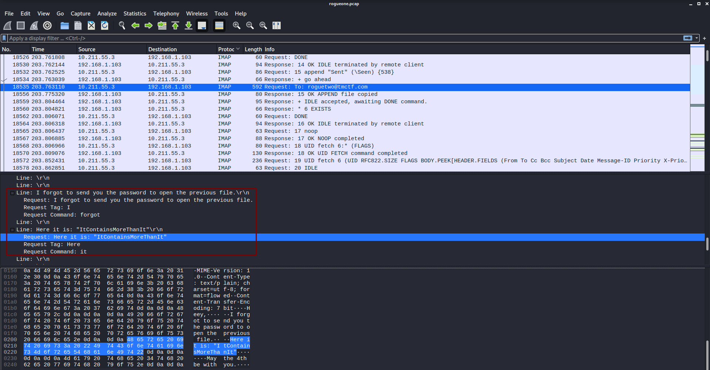
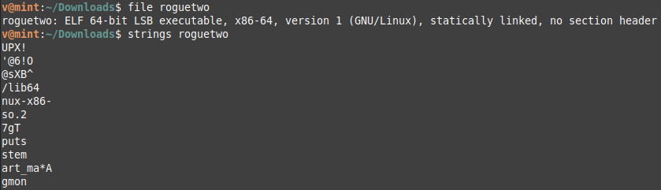
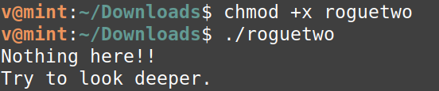
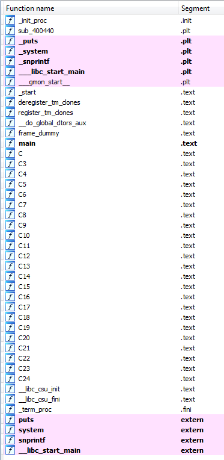
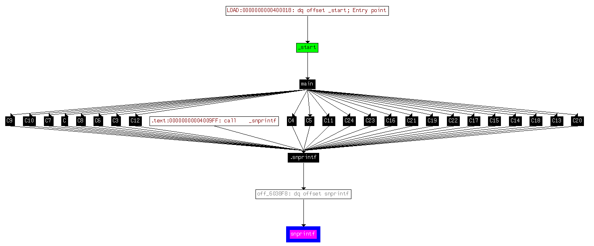
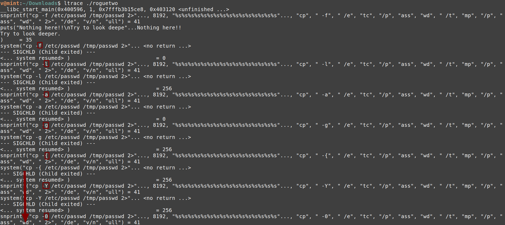

**Rogueone**
===================  
[Challenge Link](https://s3-eu-west-1.amazonaws.com/hubchallenges/Reverse/rogueone.pcap)  

> A pcap which contains communication between the galaxy riots was captured.. Try to recover their message.  
> Format: flag{xxxxxxxxxxxxx}  
> Hint: Some reversing is needed.

I opened the file with [Wireshark](https://www.wireshark.org/) and took a quick look at the packets.  
I found some base64-encoded strings being sent, when I decoded them I found the PK file signature, A zip file was being sent!  
I wanted to recover it, binwalk didn't help me.  
I used [Network Miner](https://docs.securityonion.net/en/16.04/networkminer.html) to get the file.  

I dragged-and-dropped the files to my desktop.  
I tried to extract them, they were password-protected.  
I went back to analyze the packets, when I was going through I noticed the following.

I tried to extract them again but it was the wrong password lol.  
I went back again, after some packets I found the correct password (He was trolling us :'D)  
I extracted the zip file and got a JPG picture.  
The basic analysis didn't get me anything so I tried [StegCracker](https://github.com/Paradoxis/StegCracker).  
I got a binary.. let's check it out.

[UPX](https://upx.github.io/)... I could easily unpack it.  
I executed the binary and got the following.

It's time for some reversing, I loaded it to [IDA](https://www.hex-rays.com/products/ida/) and took a look at the functions.

The Cs functions were suspicious of course but I checked sprintf first.  
It had nothing interesting so I checked its cross-reference to see where it was called.

As I said, the Cs functions were suspicious, apparently it's printing the flag character by character.  
Before using [gdb](https://www.gnu.org/software/gdb/) to debug the binary I used [ltrace](https://man7.org/linux/man-pages/man1/ltrace.1.html) first to check the library calls.. guess what I found.

YES! It's our flag:'D  
You may wonder how I noticed, if you took a closer look you would notice the command `cp -f /etc/passwd /tmp/passwd` is being repeated, but the `-f` parameter is the only one that changes every time with the corresponding characters of our flag.. nice trick :'D  

***Now you have a long way to get it yourself :p***
