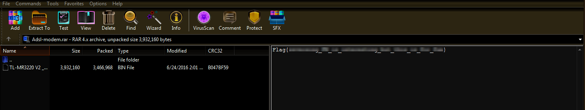

**ADSL Modem**
===================  
[Challenge Link](https://s3-eu-west-1.amazonaws.com/talentchallenges/Forensics/Adsl-modem.bin)  

> After tracking a cyber criminal.. We were able to extract this firmware from a DSL modem.  
> Try to find the flag! 

I checked the file type and it was `RAR Archive` so I changed its extension to `.rar`  
I opened it with [WinRAR](https://www.rarlab.com/download.htm) to check its content before extracting it.. I got the flag lol.

  

