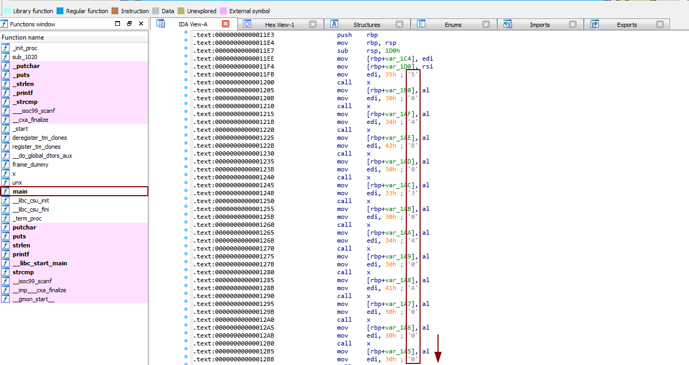

**Counter**
===================  
[Challenge Link](https://hubchallenges.s3-eu-west-1.amazonaws.com/Forensics/counter.dat)

> Hacker tried to hide information inside this binary file.  
> He is not good in remembering passwords (usually his passwords consists of 4 characters)

We were given a 64-bit ELF binary, I opened it in IDA.  
Starting from the main function.. I noticed there were multiple random values being pushed to the stack.

  

I thought it was our flag (or at least the encoded one) but I was wrong.  
I searched this [list of signatures](https://en.wikipedia.org/wiki/List_of_file_signatures) for `50 4B 03 04` and I found it, we got a zip file!  
I dumped the values then used this [site](https://tomeko.net/online_tools/hex_to_file.php) to convert them.  
I tried to extract it but it needed a password.  
I tried to crack it using the famous rockyou.txt but it failed!!  
I checked the description again, he said it's a 4-character password so I created my own wordlist.  
I cracked it again and it worked and I got the flag :'D!  
Hint: When you're creating the wordlist put into consideration: 
- The password might have repeated characters (e.g. xyzz), so the permutations function would lead you to nothing ;)  
- Don't forget to include the digits/numbers.
