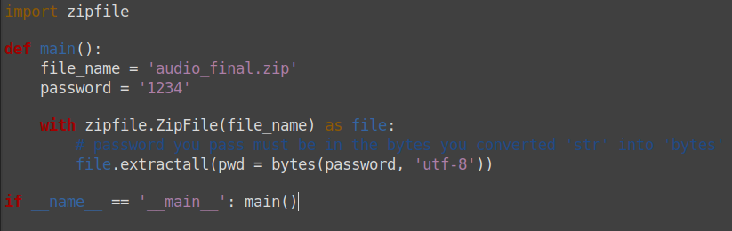

**Finding Voice**
===================  
[Challenge Link](https://s3-eu-west-1.amazonaws.com/hubchallenges/Forensics/audio_final.zip)  

> Tom created a zip file containing an audio file that has a special message.  
> Can you retrieve it? Zip password is 1234

I tried to extract it using multiple applications but none worked.  
The following script extracted it.

I got an audio file, It was dtmf-encoded.  
After some googling I found this [tool](https://github.com/ribt/dtmf-decoder) which got me the flag.
