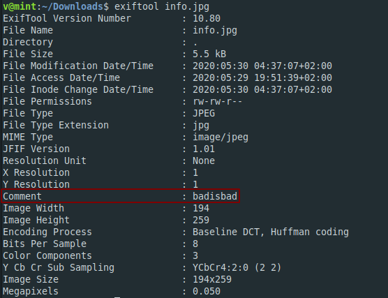
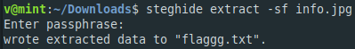

**Hack a nice day**
===================  
[Challenge Link](https://s3-eu-west-1.amazonaws.com/hubchallenges/Forensics/info.jpg)  

> Can you get the flag out to hack a nice day?    
> Flag format: flag{XXXXXXX}.

Let's extract the picture metadata  
  
I got this comment but It did not seem to be the flag.. let's use `steghide` to extract the embedded data.  
  
The passphrase is the comment we got.. easy yeah?
