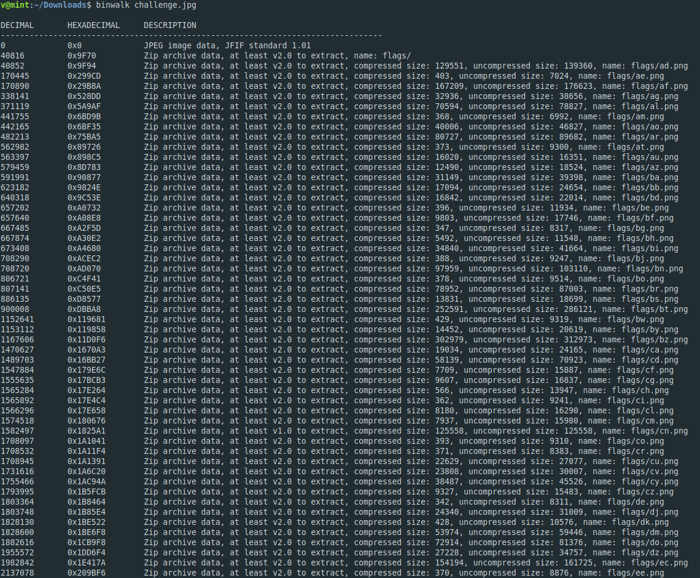
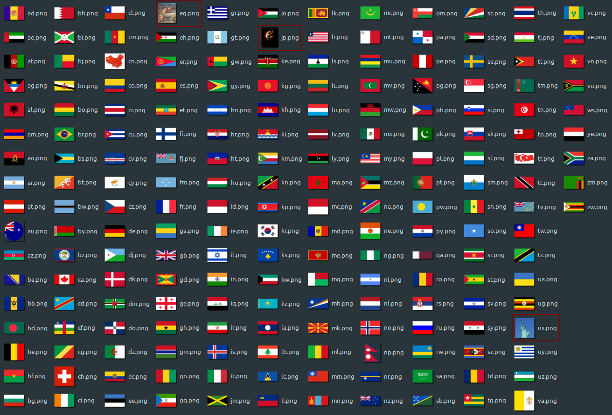
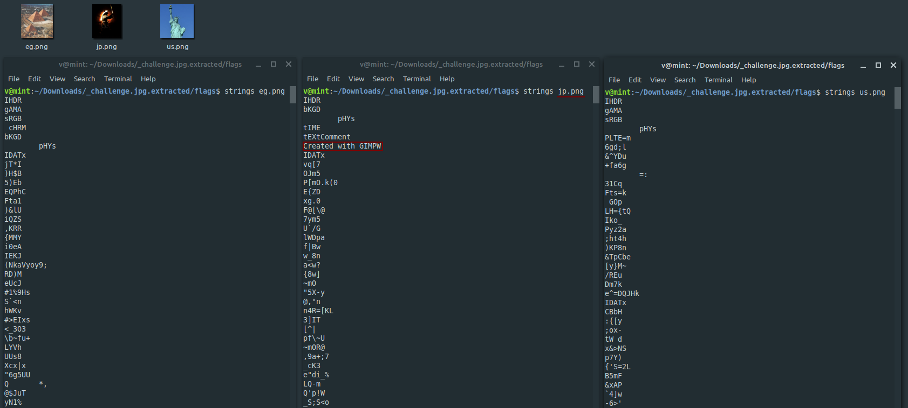

**Image Catch**
===================  
[Challenge Link](https://s3-eu-west-1.amazonaws.com/hubchallenges/Forensics/challenge.jpg)  

> Capture the flag from the supplied image.  

Its size is 7.4 MB so there must be other compressed files.. let's check.   
  
WHOA.. this is a lot.  
After extracting I got 196 pictures and of course I will never analyze them all.. I noticed there are four pictures that are not flags of countries.  
  
Let's check if any of them have any readable text.  

Download GIMP.. Play the tools.. Get the flag.
