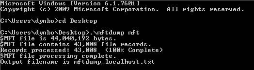

**MFT**
===================  
[Challenge Link](https://hubchallenges.s3-eu-west-1.amazonaws.com/Forensics/MFT)

> Out incident handler acquired MFT file from NTFS partition from an employee workstation who is suspected to steal excel file sheets.

From the description I knew that we need to parse this MFT file but I didn't know how to do it for windows.  
After some googling I found a command line tool called [mftdump](https://sectechno.com/mftdump-tool-to-parse-mft-files/).  
I parsed the file with it.

I was looking for an excel file so I searched the output for **.xlsx**, the excel files extension.  
I found a file with a base64-encoded name.. I decoded it and got the flag. 
