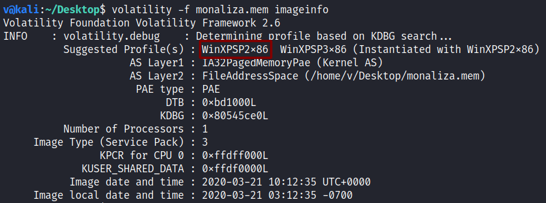
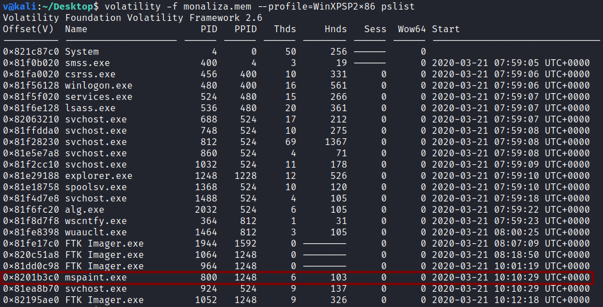
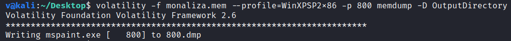
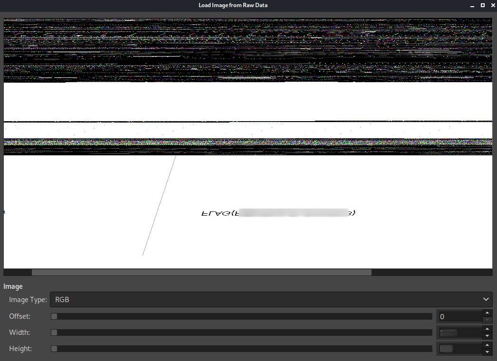

**Monaliza**
===================  
[Challenge Link](https://hubchallenges.s3-eu-west-1.amazonaws.com/Forensics/monaliza.7z)

> We couldn't identify this suspicious-user behavior, but we know he is a big fan of Monaliza.

I used the [imageinfo](https://github.com/volatilityfoundation/volatility/wiki/Command-Reference#imageinfo) command to get the suggested profile which will be passed as the parameter to `--profile` when using other plugins.  

  

Then I used the [pslist](https://github.com/volatilityfoundation/volatility/wiki/Command-Reference#pslist) plugin to see the active processes when this memory dump was taken.

  

The despriction said he is a big fan of Monaliza (= art) so this process was interesting to me.  
I dumped its memory resident pages using the [memdump](https://github.com/volatilityfoundation/volatility/wiki/Command-Reference#memdump) plugin.

  

After changing the output extension to (.data) I opened it using [Gimp](https://www.gimp.org/) then played with the offsets till I got the flag :"D

