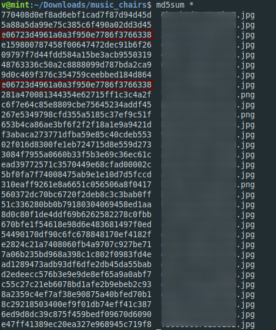
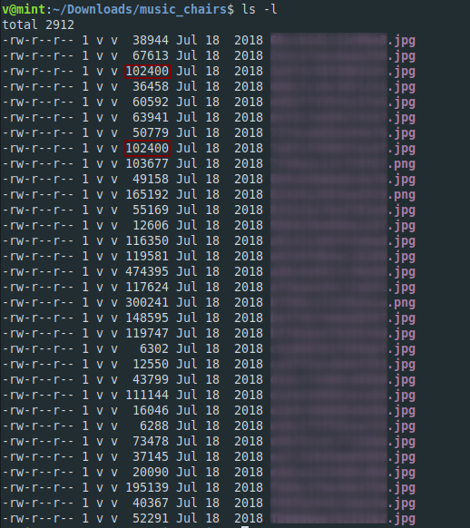

**Music Chair**
===================  
[Challenge Link](https://s3-eu-west-1.amazonaws.com/hubchallenges/Forensics/music_chairs.zip)  

> There are a bunch of singers images, however some images might be more related to each others than expected. Two of them have the flag!    
> Flag is the two file names without extensions?

Well, I'm not a music guru at all and for some reasons I thought the relation between the two pictures is their music genre or something like that but NO.  
I tried to bruteforce it.. I got 900+ strings to try ha ha ha.  
I challenged a friend to get it (as if I got the flag already lol :D).  
It took both of us a lot of time.. Let's see what we got.

There's a very rare relation between two of them which is a **Hash Collision**.  

They also have the same **Timestamp**.  

