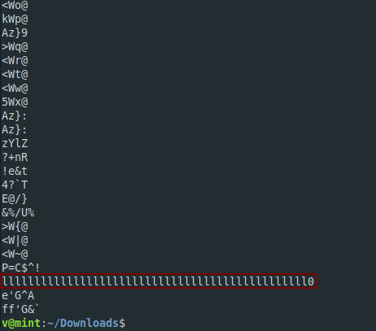

**Packet Abomination**
===================  
[Challenge Link](https://s3-eu-west-1.amazonaws.com/hubchallenges/Forensics/Packet-abomination.pcap)  

> Someone insisted on exploding the flag in a seriously messed up way.    
> Can you extract the MD5 hash?

I was not able to get any readable text after running `strings`.. Let's open it with Wireshark.

I spent more than 1 hour analyzing the packets and trying to find anything useful but It didn't work out.  
The only hint I got was *seriously messed up way* and ugh.. I knew this wasn't gonna be easy.  
Back to `strings` I noticed this

  
I googled for hints but I got nothing.. I thought of using it as a filter in Wireshark and BOOM.. Let me tell you how I got the flag.

1- Make sure to select Regular Expression and Packet bytes before filtering the packets.  
2- After the filtering click on the info coloumn to sort them.  
3- I noticed the Malformed Packets so I knew they have the flag but how? Take a look at the hexdump section.. all characters are the same but the last one.  
4- Open a text editor.. add the last one and do the same for every Malformed Packet.  
5- You will get a 32-character hash.. It's the flag.

***I hate this challenge*** 
