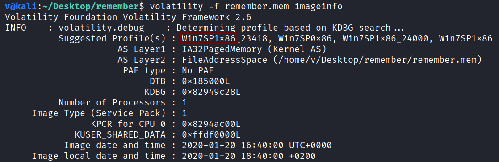
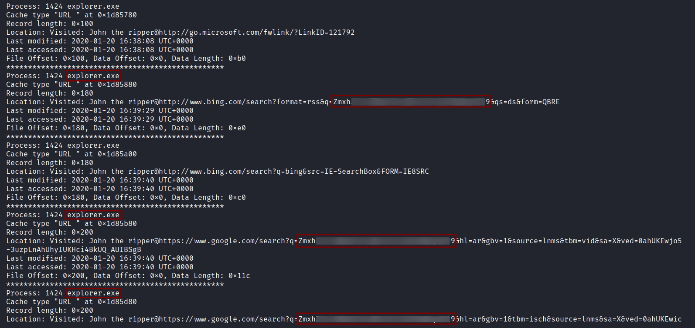
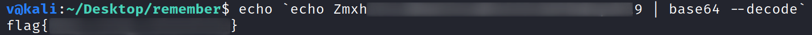

**Remember Me**
===================  
[Challenge Link](https://hubchallenges.s3-eu-west-1.amazonaws.com/Forensics/remember.zip)  

> After acquiring memory from the attacker pc we found there is no internet browser except internet explorer.  
> Can you get the internet history? 

I used the [imageinfo](https://github.com/volatilityfoundation/volatility/wiki/Command-Reference#imageinfo) command to get the suggested profile which would be passed as the parameter to `--profile` when using other plugins.  

The description gave me a big clue so I used the [iehistory](https://github.com/volatilityfoundation/volatility/wiki/Command-Reference#iehistory) plugin to find recent accessed links.

I noticed this encoded string being repeated multiple times so I decoded it.  

