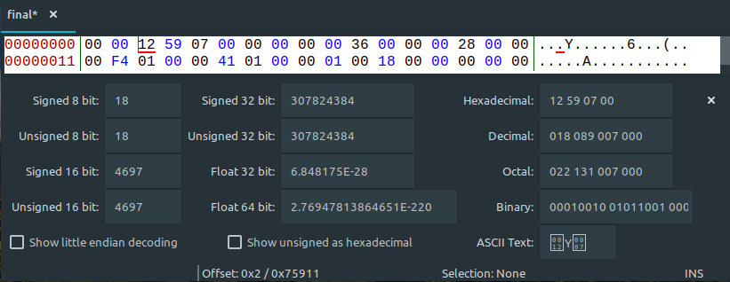
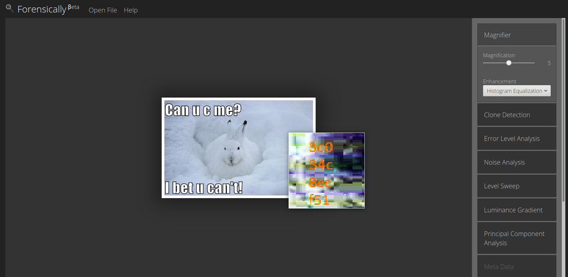
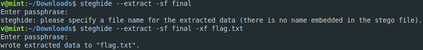

**Try to see me**
===================  
[Challenge Link](https://s3-eu-west-1.amazonaws.com/hubchallenges/Forensics/final)  

> You will need your glasses or good pair of eyes and some brainzzz.

Since it was a corrupted file I opened it with a hex editor to check its signature.

It did not give any hints of what the correct signature is but I knew I had to replace `00 00` with something else.  
I checked this [list](https://en.wikipedia.org/wiki/List_of_file_signatures) and found few signatures starting with only two bytes.  
I decided to try them all.. BM signature is the correct one.  
Replace `00 00` with `42 4D` using whatever hex editor you like.. I used [bless](https://github.com/bwrsandman/Bless).  
I got a picture.. Zooming in.. I noticed a strange orange color in the snow but I couldn't see well so I opened it with [Forensically](https://29a.ch/photo-forensics/#forensic-magnifier).

I got a 32-character hash.. I submitted it.. It was not the flag.  
I cracked it.. I submitted it.. It was not the flag.  
I tried `binwalk` but there wasn't any compressed data.  
I tried `steghide` and here we go again

  
The passphrase is the hash we got.
