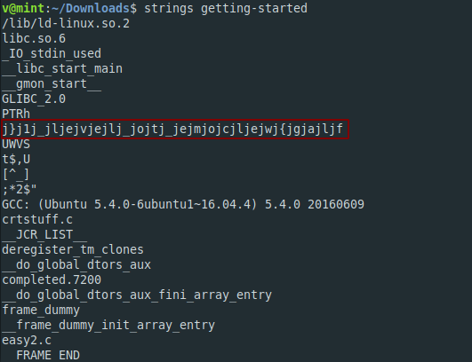

**Getting Started**
===================  
[Challenge Link](https://s3-eu-west-1.amazonaws.com/talentchallenges/Reverse/getting-started)  

> The correct input is the flag.  
> Format: flag{xxxxxxxxxxxxxxxxxxxxxxxxxxxxxx}

Let's try `strings` to see if we can get any readable text.

I noticed the curly brackets and the number of Js felt suspicious.. I deleted them and got the flag but It was reversed.
 
