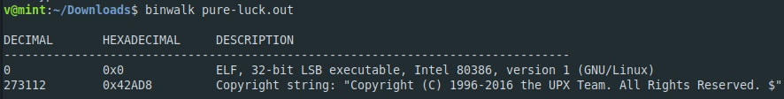

**Pure Luck**
===================  
[Challenge Link](https://s3-eu-west-1.amazonaws.com/hubchallenges/Reverse/pure-luck.out)  

> Format:flag{xxxxxxxxxxxxxxxxxxxxxxxxx}.  

Let's check what we got.  

 

We have to unpack it.. Download the unpacker from [here](https://github.com/upx/upx).  
Open it with whatever disassembler you like.. I used [Cutter](https://cutter.re/).  
Going through the main function you will find some values that are pushed to the stack which apparently they seem to be the flag.

 
