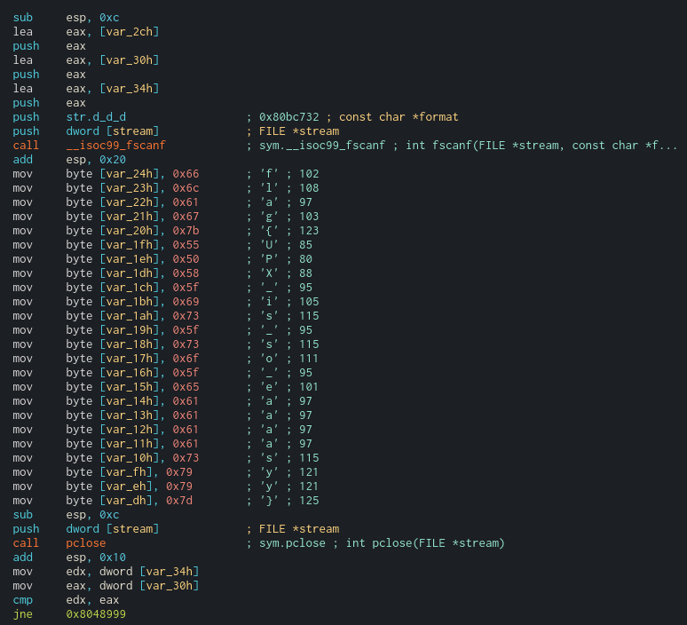

**Pure Luck**
===================  
[Challenge Link](https://s3-eu-west-1.amazonaws.com/hubchallenges/Reverse/pure-luck.out)

> Format:flag{xxxxxxxxxxxxxxxxxxxxxxxxx}.  

Let's check what we got.

We have to unpack it.. Download the unpacker from [here](https://upx.github.io/).  
Open it with whatever disassembler you like.. I used [Cutter](https://cutter.re/).  
Going through the main function you will notice some values that are pushed to the stack which apperantly they seem to be the flag.

