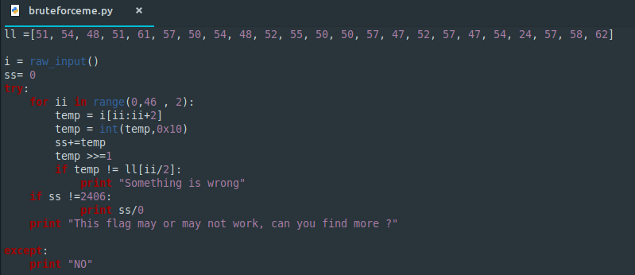
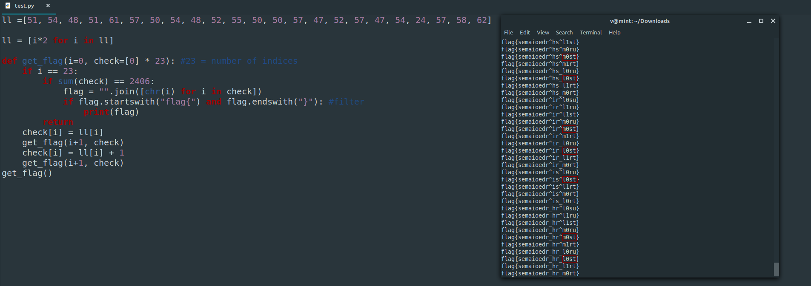
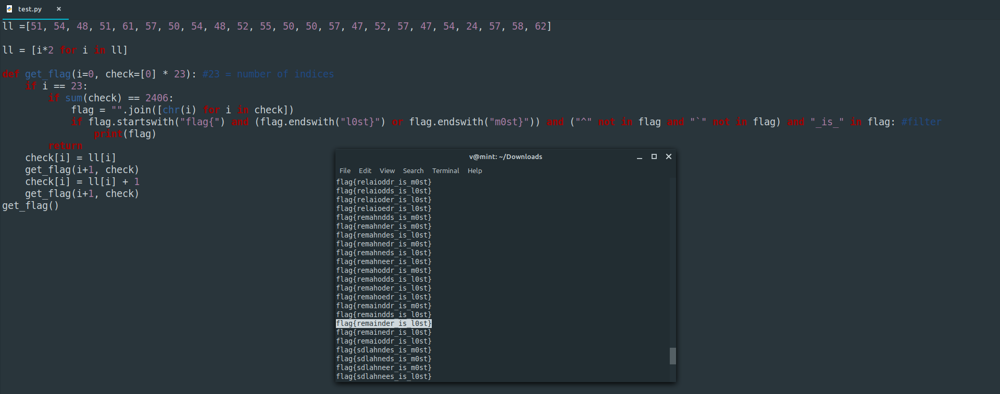

**Bruteforce Me**
===================  
[Challenge Link](https://s3-eu-west-1.amazonaws.com/hubchallenges/Reverse/bruteforceme.py)

> Format: flag{xxxxxxxxxxxxxxxxxxxxxxxxxxxxxx}.  
> Only a-z,0-9,_ are allowed, Try to find the only flag that makes sense.  
> Recursion will help you.

We got a python script.. let's check it.

To break this code we first need to understand how it works.  
 1. It declares a list and set some values in it.
 2. It takes input from the user. 
 3. It loops in range 0 to 46 with a step of 2. 
 4. It sets some value in `temp`.
 5. It converts this value to hex.
 6. It adds the hex value to `ss`.
 7. It shifts the value to right by 1 bit.  
 Note: for positive numbers.. a single logical right shift divides a number by 2.. throwing out any remainders.
 8. It checks the value of `temp` then prints something.
 9. After the loop ends It checks the value of `ss` then prints a value which may or may not be our flag.

I first thought that the characters in the list are the flag but ascii-encoded.. I was wrong.  
In the same [site](https://onlinestringtools.com/convert-string-to-ascii) I converted *flag* to ascii.. It's *102 108 97 103*.. The first 3 values are `ll[:3]` multiplied by  2.  
Well.. we already know that remainders are thrown away which means `102 >> 1` is equal to `103 >> 1` so the the list -multiplied by 2- is our flag.. but each value might be the same or ± 1.  
After some googling I learnt more about recursion.. Here is my first correct attempt (after a lot of solved bugs lol).

It printed hundreds of strings.. of course I would never check them all.  
The challenge description said `Try to find the only flag that makes sense`.. `l0st` and `m0st` made sense after checking the others so I added filters to grep them.  
I also noticed ^ and `.. They are not allowed so I added more filters.  
Here is my final attempt which got me the flag.

