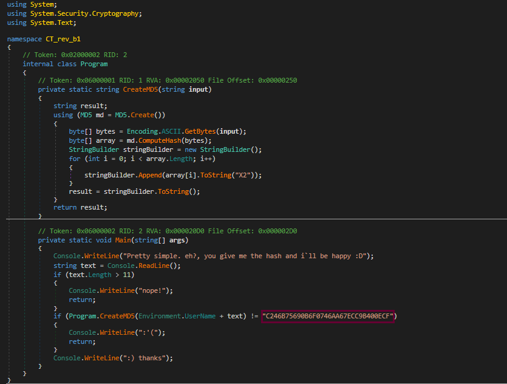

**Developer Locks**
===================  
[Challenge Link](https://s3-eu-west-1.amazonaws.com/hubchallenges/Reverse/Developer-locks.exe)

> This is kinda easy to the degree that you`ll be asked for the hash at once.  

I used [dnSpy](https://github.com/0xd4d/dnSpy) to decompile this file.  

The upper class generates MD5 hashes.  
The lower function checks if it's the correct hash.. as you can see the hash it conforms to.  
Crack this hash.. It's the flag.. I used this [online cracker](https://hashes.com/en/decrypt/hash).
